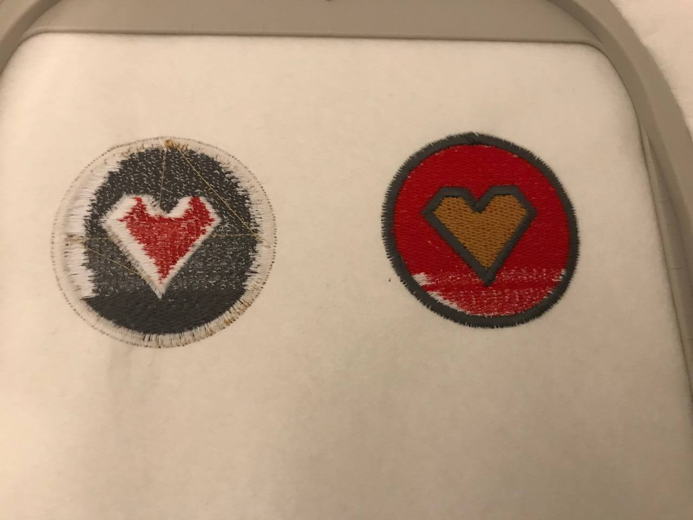



## Daten zur Stickmaschine

Modell: Brother Innov-is NV800E

Für diese Stickmaschine besitzt Brother folgende Stickrahmen:
* Stickrahmen 100 x 100 mm Brother innov-is 800E 870SE 880E
* Stickrahmen 180 x 130 mmn Brother innov-is 800E 870SE 880E
* Stickrahmen 260 x 160 mm Brother innov-is 800E 870SE 880E (Der in unserem Space)
* Stickrahmen 60 x 20 mm Brother innov-is 800E 870SE 880E
* Stickrahmen Quilt 150 x 150 mm Brother innov-is 800E 2600 V3 V5 V7 XV

Die Stickmaschine akzeptiert folgende Dateiformate:
* .dst
* .

## Handbuch

Zur Stickmaschine gehört ein physikalisches Handbuch.
Das Digitale befindet sich hier: https://support.brother.com/g/b/manualtop.aspx?c=de&lang=de&prod=hf_inov800eeuk

## Vollständigkeit / Material

Zur Stickmaschine gehört:
* Die Maschine
* Der Stickrahmen
* Ein EU Kabel
* Eine Box mit Garn und Spulen

## Material dass du zum Sticken brauchst

* USB Stick (Achtung: Es werden nur USB Sticks von der [Kompatibilitätsliste für USB-Medien](https://support.brother.com/g/b/manualtop.aspx?c=de&lang=de&prod=hf_inov800eeuk) akzeptiert)
* Unterfaden + Spule
* Stickgarn (ggf in mehreren Farben)
* Schere
* Stickfließ und / oder Stoff

-----

## Sticksoftware

Sagt euch gesagt: Es gibt wirklich sehr viel Sticksoftware und keine davon ist perfekt.
Ich habe hier versucht alles was mir untergekommen ist zu sammeln.

| Software          | Früherer Name   | Preis       | Open Source | Für Linux | Für Windows | Für Mac | Designs Bearbeiten | Designs Erstellen |
|-------------------|-----------------|-------------|-------------|-----------|-------------|---------|--------------------|-------------------|
| SophieSew         | -               | kostenlos   | -           | -         | x           | -       | x                  | x                 |
| Ink/Stitch        | -               | kostenlos   | x           | x         | x           | x       | x                  | x                 |
| Premier+ ECQ      | -               | 400€        | -           | -         | x           | x       | x                  | x                 |
| PE Design         | -               | 600 - 1800€ | -           | -         | x           | -       | x                  | x                 |
| mySewnet          | TruEmbroidery   |             |             |           |             |         |                    |                   |
| mySewnet® SILVER  | Premier+2 Intro | 100€        | -           | -         | x           | x       | x                  | -                 |
| mySewnet PLATINUM |                 | 900€        | -           | -         | x           | x       | x                  | x                 |
| mySewnet BASIC    | Premier+2 FREE  | kostenlos   | ?           | -         | x           | x       | x                  | -                 |
*stand: 2022*

### Sollte ich Geld für eine Sticksoftware ausgeben?

Wenn du ausschließlich fertige Design sticken möchtest musst du keine teure Sticksoftware kaufen.
Um Stickdesigns anzupassen, oder z.B. mit einem Schriftzug zu verziehen reicht eine der kostenlosen Verianten.

Möchtest du eigene Designs erstellen, dich aber nicht näher mit der Software auseinandersetzen, dann ist Premier+ ECQ einen Blick wert. Hier kannst du von deiner Zeichnung (vektor, or jpg) direkt das Stickdesign mit ein paar Klicks erstellen lassen. 

Mit Inks/Stitch und SophieSew hast du kostenlose Programme welche vollwertig Designs bearbeiten und erstllen können.
SophieSew ist sehr unintiutiv, erlaubt dir jedoch jedes noch so kleine Detail anzupassen. Achtung du kannst keinen Schritt rückgangig machen, es lohnt sich also nach jeder Anpassungen zu speichern und Dateien mit unterschiedlichen versionen anzilegen.
Ink/Stitch hat eine gute Dokumentation und viele Erklär-Videos.

Möchtest du professionell Stickdateien anlegen, dann sind PE Design, oder mySewnet wahrscheinlich eher deine Wahl.
Hier hast du den Vorteil, dass mit der Zeit immer wieder Updates kommen, Fehler ausgebessert werden und es allgemein ein sehr einheitliches Vorgehen gibt.

----

## Stickdateien

Dateiformat: ...coming soon

### Stickdateien sticken

1. Stickdatei auf den USB Stick laden
2. USB Stick in die Stickmaschine stecken
... coming soon

### Stickdateien bearbeiten

... coming soon

### Stickdateien erstellen

#### SVG, PNG, oder JPG?
Als Basis für dein eigenes Stickdesign kannst du jedes gängige Bildformat verwenden.
PNGs und JPGs musst du dabei digital nachzeichnen.
In SVG Dateien sind die Pfade der Grafik bereits hinterlegt und können importiert werden. Es erleichtert die somit die Arbeit mit SVGs zu arbeiten.

##### Mit SophieSew

[YouTube Tutorial](https://www.youtube.com/watch?v=-8QeWSwq_iI)

##### Mit Ink/Stitch

[Video Tutorial](https://inkstitch.org/de/tutorials/lex-neva-video-tutorial-1/)

##### Mit MySewnet Platinum

[YouTube Tutorial](https://www.youtube.com/watch?v=ltnKMixdSvQ)

----

## Wikis of Friends

Das Rauzeitlabor hat bereits viele tolle Hilfen rund um ihre Stickmaschinen geschrieben:
* https://wiki.raumzeitlabor.de/wiki/Rarity

Das Chaotikum in Lübeck besitzt ebenfalls eine Stickmaschine:
* https://wiki.chaotikum.org/hackspace:werkstatt:stickmaschine

----

## F.A.Q. und Troubleshooting

### Hilfe mein Unterfaden kommt hoch.
Der Faden, welcher unter der Nadel in die Maschine eingefädelt ist, ist der Unterfaden. 
Wenn die Farbe die du möchstest nicht als solche im Stickmuster erscheint, sondern die Farbe des Unterfadens zu sehen ist, dann kommt der Unterfaden hoch.

Im linken Bild ist dies sehr gut zu sehen. Der weiße Unterfaden ist zu sehen, die Farbe die das Stickmuster eigentlich haben sollte nicht mehr.
Das Problem liegt ein einer falschen Ober- oder Unterfadenspannung.
Schaue dafür ob alle Fäden und Spuhlen wirktlich korrekt eingädelt wurden und mache es genau nach Anleitung.
Lese in der Bedinungsanleitung nach wie du die Fadenspannung der Maschine anpasst und schaue bei welcher Fadenspannung sich das Ergebnis sich wieder normalisiert.
Zum Vergleich:
Auf der rechten Seite des Bildes wird der Kreis von unten nach oben gestickt. Man kann am unteren Teil noch leichte Weiß-Durchbrüche erkennen, während nach und nach die Fadenspannung angepasst wurde, bis das gewünschte Stickergebnis entsteht.